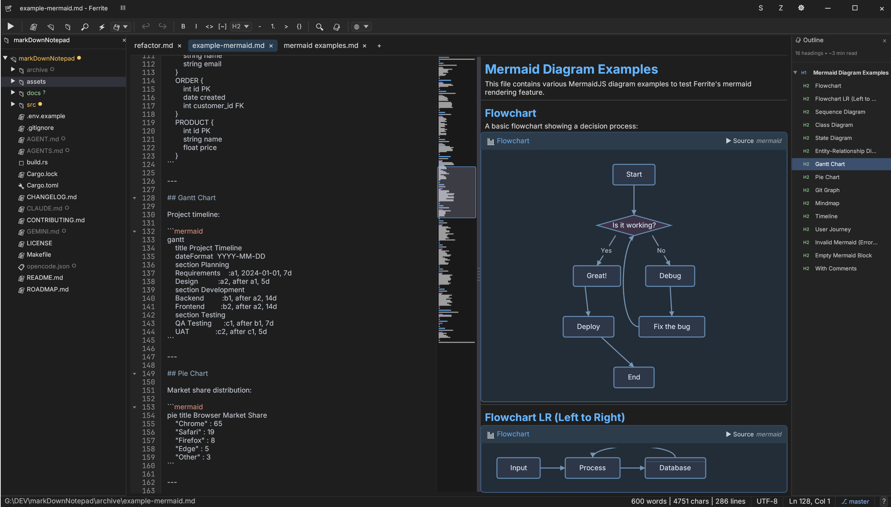

# Ferrite

[](LICENSE)
[](https://www.rust-lang.org/)

A fast, lightweight text editor for Markdown, JSON, YAML, and TOML files. Built with Rust and egui for a native, responsive experience.

> ⚠️ **Platform Note:** Ferrite has been primarily developed and tested on **Windows**. While it should work on Linux and macOS, these platforms have not been extensively tested. If you encounter issues, please [report them](https://github.com/OlaProeis/Ferrite/issues).

> 🤖 **AI Disclosure:** This project is 100% AI-generated code. All Rust code, documentation, and configuration was written by Claude (Anthropic) via [Cursor](https://cursor.com) with MCP tools. My role is product direction, testing, and learning to orchestrate AI-assisted development effectively. The code is reviewed and tested, not blindly accepted — but I want to be transparent about the development process. This project is partly a learning exercise in exploring how far AI-assisted development can go.

## Screenshots

| Raw Editor | Rendered View |
|------------|---------------|
|  |  |

| Split View | Zen Mode |
|------------|----------|
|  |  |

## Features

### Core Editing
- **WYSIWYG Markdown Editing** - Edit markdown with live preview, click-to-edit formatting, and syntax highlighting
- **Multi-Format Support** - Native support for Markdown, JSON, YAML, and TOML files
- **Tree Viewer** - Hierarchical view for JSON/YAML/TOML with inline editing, expand/collapse, and path copying
- **Find & Replace** - Search with regex support and match highlighting
- **Undo/Redo** - Full undo/redo support per tab

### View Modes
- **Split View** - Side-by-side raw editor and rendered preview with resizable divider
- **Zen Mode** - Distraction-free writing with centered text column
- **Sync Scrolling** - Bidirectional scroll sync between raw and rendered views

### Editor Features
- **Syntax Highlighting** - Full-file syntax highlighting for 40+ languages (Rust, Python, JavaScript, Go, etc.)
- **Code Folding** - Fold detection with gutter indicators (▶/▼) for headings, code blocks, and lists (text hiding deferred to v0.3.0)
- **Minimap** - VS Code-style navigation panel with click-to-jump and search highlights
- **Bracket Matching** - Highlight matching brackets `()[]{}<>` and emphasis pairs `**` `__`
- **Auto-Save** - Configurable auto-save with temp-file safety
- **Line Numbers** - Optional line number gutter

### MermaidJS Diagrams
Native rendering of 11 diagram types directly in the preview:
- Flowchart, Sequence, Pie, State, Mindmap
- Class, ER, Git Graph, Gantt, Timeline, User Journey

> ✨ **v0.2.1 Released:** Enhanced Mermaid support with sequence control-flow blocks (`loop`, `alt`, `opt`, `par`), activation boxes, notes, flowchart subgraphs with branching layout, and composite/nested states. See [CHANGELOG.md](CHANGELOG.md) for full details.

### Workspace Features
- **Workspace Mode** - Open folders with file tree, quick switcher (Ctrl+P), and search-in-files (Ctrl+Shift+F)
- **Git Integration** - Visual status indicators showing modified, added, untracked, and ignored files
- **Session Persistence** - Restore open tabs, cursor positions, and scroll offsets on restart

### Additional Features
- **Light & Dark Themes** - Beautiful themes with runtime switching
- **Document Outline** - Navigate large documents with the outline panel
- **Export Options** - Export to HTML with themed styling, or copy as HTML
- **Formatting Toolbar** - Quick access to bold, italic, headings, lists, links, and more
- **Live Pipeline** - Pipe JSON/YAML content through shell commands (for developers)
- **Custom Window** - Borderless window with custom title bar and resize handles

## Installation

### Pre-built Binaries

Download the latest release for your platform from [GitHub Releases](https://github.com/OlaProeis/Ferrite/releases).

| Platform | Download |
|----------|----------|
| Windows  | `ferrite-windows-x64.zip` |
| Linux    | `ferrite-editor_amd64.deb` (recommended) or `ferrite-linux-x64.tar.gz` |
| macOS    | `ferrite-macos-x64.tar.gz` |

#### Linux Installation

**Using .deb package (Debian/Ubuntu/Mint - Recommended):**
```bash
# Download the .deb file, then install with:
sudo apt install ./ferrite-editor_amd64.deb

# Or using dpkg:
sudo dpkg -i ferrite-editor_amd64.deb
```

This will:
- Install Ferrite to `/usr/bin/ferrite`
- Add desktop entry (appears in your app menu)
- Register file associations for `.md`, `.json`, `.yaml`, `.toml` files
- Install icons for the system

**Arch Linux package**

[](https://aur.archlinux.org/packages/ferrite/)
[](https://aur.archlinux.org/packages/ferrite-bin/)

Ferrite is available on the [AUR](https://wiki.archlinux.org/index.php/Arch_User_Repository):
- [Ferrite](https://aur.archlinux.org/packages/ferrite/) (release package)
- [Ferrite-bin](https://aur.archlinux.org/packages/ferrite-bin/) (binary package)

You can install it using your [AUR helper](https://wiki.archlinux.org/index.php/AUR_helpers) of choice.

Example:
```console
# Release package
yay -Sy ferrite

# Binary package
yay -Sy ferrite-bin
```

**Using tar.gz (any Linux distro):**
```bash
tar -xzf ferrite-linux-x64.tar.gz
./ferrite
```

### Build from Source

#### Prerequisites

- **Rust 1.70+** - Install from [rustup.rs](https://rustup.rs/)
- **Platform-specific dependencies:**

**Windows:**
- Visual Studio Build Tools 2019+ with C++ workload

**Linux:**
```bash
# Ubuntu/Debian
sudo apt install build-essential pkg-config libgtk-3-dev libxcb-shape0-dev libxcb-xfixes0-dev

# Fedora
sudo dnf install gcc pkg-config gtk3-devel libxcb-devel

# Arch
sudo pacman -S base-devel pkg-config gtk3 libxcb
```

**macOS:**
```bash
xcode-select --install
```

#### Build

```bash
# Clone the repository
git clone https://github.com/OlaProeis/Ferrite.git
cd Ferrite

# Build release version (optimized)
cargo build --release

# The binary will be at:
# Windows: target/release/ferrite.exe
# Linux/macOS: target/release/ferrite
```

## Usage

### Launch

```bash
# Run from source
cargo run --release

# Or run the binary directly
./target/release/ferrite

# Open a specific file
./target/release/ferrite path/to/file.md

# Open a folder as workspace
./target/release/ferrite path/to/folder/
```

### View Modes

Ferrite supports three view modes for Markdown files:

- **Raw** - Plain text editing with syntax highlighting
- **Rendered** - WYSIWYG editing with rendered markdown
- **Split** - Side-by-side raw editor and live preview

Toggle between modes using the toolbar buttons or keyboard shortcuts.

## Keyboard Shortcuts

### File Operations

| Shortcut | Action |
|----------|--------|
| `Ctrl+N` | New file |
| `Ctrl+O` | Open file |
| `Ctrl+S` | Save file |
| `Ctrl+Shift+S` | Save as |
| `Ctrl+W` | Close tab |

### Navigation

| Shortcut | Action |
|----------|--------|
| `Ctrl+Tab` | Next tab |
| `Ctrl+Shift+Tab` | Previous tab |
| `Ctrl+P` | Quick file switcher (workspace) |
| `Ctrl+Shift+F` | Search in files (workspace) |

### Editing

| Shortcut | Action |
|----------|--------|
| `Ctrl+Z` | Undo |
| `Ctrl+Y` / `Ctrl+Shift+Z` | Redo |
| `Ctrl+F` | Find |
| `Ctrl+H` | Find and replace |
| `Ctrl+B` | Bold |
| `Ctrl+I` | Italic |
| `Ctrl+K` | Insert link |

### View

| Shortcut | Action |
|----------|--------|
| `F11` | Toggle fullscreen |
| `Ctrl+,` | Open settings |
| `Ctrl+Shift+[` | Fold all |
| `Ctrl+Shift+]` | Unfold all |

## Configuration

Settings are stored in platform-specific locations:

- **Windows:** `%APPDATA%\ferrite\`
- **Linux:** `~/.config/ferrite/`
- **macOS:** `~/Library/Application Support/ferrite/`

Workspace settings are stored in `.ferrite/` within the workspace folder.

### Settings Panel

Access settings via `Ctrl+,` or the gear icon. Configure:

- **Appearance:** Theme, font family, font size
- **Editor:** Word wrap, line numbers, minimap, bracket matching, code folding, syntax highlighting
- **Files:** Auto-save, recent files history

## Roadmap

See [ROADMAP.md](ROADMAP.md) for planned features and known issues.

## Contributing

Contributions are welcome! Please see [CONTRIBUTING.md](CONTRIBUTING.md) for guidelines.

### Quick Start for Contributors

```bash
# Fork and clone
git clone https://github.com/YOUR_USERNAME/Ferrite.git
cd Ferrite

# Create a feature branch
git checkout -b feature/your-feature

# Make changes, then verify
cargo fmt
cargo clippy
cargo test
cargo build

# Commit and push
git commit -m "feat: your feature description"
git push origin feature/your-feature
```

## Tech Stack

| Component | Technology |
|-----------|------------|
| Language | Rust 1.70+ |
| GUI Framework | egui 0.28 + eframe 0.28 |
| Markdown Parser | comrak 0.22 |
| Syntax Highlighting | syntect 5.1 |
| Git Integration | git2 0.19 |
| File Dialogs | rfd 0.14 |
| Clipboard | arboard 3 |
| File Watching | notify 6 |
| Fuzzy Matching | fuzzy-matcher 0.3 |

## License

This project is licensed under the MIT License - see the [LICENSE](LICENSE) file for details.

## Acknowledgments

### Libraries
- [egui](https://github.com/emilk/egui) - Immediate mode GUI library for Rust
- [comrak](https://github.com/kivikakk/comrak) - CommonMark + GFM compatible Markdown parser
- [syntect](https://github.com/trishume/syntect) - Syntax highlighting library
- [git2](https://github.com/rust-lang/git2-rs) - libgit2 bindings for Rust
- [Inter](https://rsms.me/inter/) and [JetBrains Mono](https://www.jetbrains.com/lp/mono/) fonts

### Development Tools
- [Claude](https://anthropic.com) (Anthropic) - AI assistant that wrote the code
- [Cursor](https://cursor.com) - AI-powered code editor
- [Task Master](https://github.com/eyaltoledano/claude-task-master) - AI task management for development workflows
