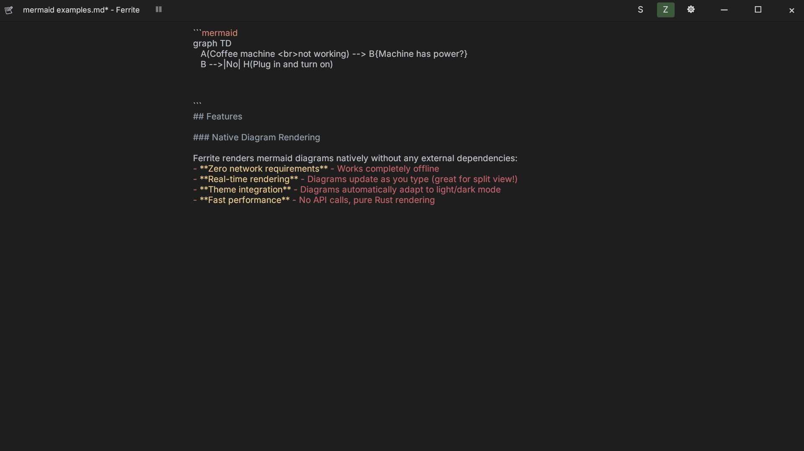

# Ferrite

<div align="center">

[](https://getferrite.dev)
[](https://github.com/OlaProeis/Ferrite/releases)
[](LICENSE)
[](https://github.com/OlaProeis/Ferrite/stargazers)
[](https://github.com/OlaProeis/Ferrite/issues)
[](https://hosted.weblate.org/engage/ferrite/)

**[getferrite.dev](https://getferrite.dev)** — Official website with downloads, features, and documentation

</div>

A fast, lightweight text editor for Markdown, JSON, YAML, and TOML files. Built with Rust and egui for a native, responsive experience.

> ⚠️ **Platform Note:** Ferrite is developed and tested on **Windows** and **Linux**. macOS support is experimental. If you encounter issues, please [report them](https://github.com/OlaProeis/Ferrite/issues).

<details>
<summary><strong>🛡️ Antivirus False Positives</strong></summary>

Some antivirus software (particularly Windows Defender) may flag Ferrite as suspicious. **This is a false positive.** Here's why it happens and what we've done about it:

### Why This Happens
- **Live Pipeline feature**: Ferrite's pipeline feature lets you pipe document content through shell commands (like `jq` or `grep`). This uses `cmd.exe /C` on Windows, which ML-based antivirus detection can mistake for trojan behavior.
- **Rust compilation patterns**: Rust binaries can trigger heuristic detections due to their unique compilation characteristics.

### What We've Done
- **Reported to Microsoft**: We've submitted Ferrite to Microsoft's Security Intelligence portal as a false positive (January 2026).
- **Adjusted build settings**: We've modified our release profile to avoid patterns that trigger ML detection (disabled symbol stripping, switched from size to speed optimization).
- **Open source transparency**: All code is publicly auditable at [github.com/OlaProeis/Ferrite](https://github.com/OlaProeis/Ferrite).

### If You're Affected
If Windows Defender quarantines Ferrite:
1. **Verify the source**: Only download from [official GitHub releases](https://github.com/OlaProeis/Ferrite/releases)
2. **Add an exclusion**: Windows Security → Virus & threat protection → Exclusions → Add the Ferrite executable
3. **Check VirusTotal**: Upload the file to [VirusTotal](https://www.virustotal.com) - legitimate Ferrite builds should show clean or near-clean results from most scanners

Ferrite does **NOT** access passwords, browser data, or make network connections. The application is fully offline and only accesses files you explicitly open.

</details>

## 🤖 AI-Assisted Development

This project is 100% AI-generated code. All Rust code, documentation, and configuration was written by Claude (Anthropic) via [Cursor](https://cursor.com) with MCP tools.

<details>
<summary><strong>About the AI workflow</strong></summary>

### My Role
- **Product direction** — Deciding what to build and why
- **Testing** — Running the app, finding bugs, verifying features
- **Review** — Reading generated code, understanding what it does
- **Orchestration** — Managing the AI workflow effectively

### The Workflow
1. **Idea refinement** — Discuss concepts with multiple AIs (Claude, Perplexity, Gemini Pro)
2. **PRD creation** — Generate requirements using [Task Master](https://github.com/task-master-ai/task-master)
3. **Task execution** — Claude Opus handles implementation (preferring larger tasks over many subtasks)
4. **Session handover** — Structured prompts maintain context between sessions
5. **Human review** — Every handover is reviewed; direction adjustments made as needed

📖 **Full details:** [AI Development Workflow](docs/ai-workflow/ai-development-workflow.md)

### Open Process
The actual prompts and documents used to build Ferrite are public:

| Document | Purpose |
|----------|---------|
| [`current-handover-prompt.md`](docs/current-handover-prompt.md) | Active session context |
| [`ai-workflow/`](docs/ai-workflow/) | Full workflow docs, PRDs, historical handovers |
| [`handover/`](docs/handover/) | Reusable handover templates |

This transparency is intentional — I want others to learn from (and improve upon) this approach.

</details>

## Screenshots



| Raw Editor | Split View | Zen Mode |
|------------|------------|----------|
|  |  |  |

> ✨ **v0.2.6 Released:** **New Custom Editor Engine** with massive performance improvements for large files (80MB file uses ~80MB RAM, was 460MB+), **Multi-Cursor Editing** (Ctrl+Click to add cursors), **Code Folding** with content hiding (click ▶/▼ indicators), improved IME/CJK input, and cursor blink/auto-focus fixes. See [CHANGELOG.md](CHANGELOG.md) for full details.

> 📦 **v0.2.5.3 Highlights:** View Mode Segmented Control, 100+ syntax languages, 25+ syntax themes, Flathub submission.

## Features

### Core Editing
- **WYSIWYG Markdown Editing** - Edit markdown with live preview, click-to-edit formatting, and syntax highlighting
- **Multi-Format Support** - Native support for Markdown, JSON, CSV, YAML, and TOML files
- **Multi-Encoding Support** - Auto-detect and preserve file encodings (UTF-8, Latin-1, Shift-JIS, Windows-1252, GBK, and more)
- **Tree Viewer** - Hierarchical view for JSON/YAML/TOML with inline editing, expand/collapse, and path copying
- **Find & Replace** - Search with regex support and match highlighting
- **Go to Line (Ctrl+G)** - Quick navigation to specific line number
- **Undo/Redo** - Full undo/redo support per tab

### View Modes
- **Split View** - Side-by-side raw editor and rendered preview with resizable divider; both panes are fully editable
- **Zen Mode** - Distraction-free writing with centered text column

### Editor Features
- **Syntax Highlighting** - Full-file syntax highlighting for 40+ languages (Rust, Python, JavaScript, Go, etc.)
- **Code Folding** - Fold/unfold regions with gutter indicators (▶/▼) for headings, code blocks, and lists; collapsed content is hidden
- **Semantic Minimap** - Navigation panel with clickable header labels, content type indicators, and text density bars (switchable to VS Code-style pixel view)
- **Multi-Cursor Editing** - Ctrl+Click to add multiple cursors; type, delete, and navigate at all positions simultaneously
- **Bracket Matching** - Highlight matching brackets `()[]{}<>` and emphasis pairs `**` `__`
- **Auto-close Brackets & Quotes** - Type `(`, `[`, `{`, `"`, or `'` to get matching pair; selection wrapping supported
- **Duplicate Line (Ctrl+Shift+D)** - Duplicate current line or selection
- **Move Line Up/Down (Alt+↑/↓)** - Rearrange lines without cut/paste
- **Smart Paste for Links** - Select text then paste URL to create `[text](url)` markdown link
- **Drag & Drop Images** - Drop images into editor to auto-save to `./assets/` and insert markdown link
- **Table of Contents** - Generate/update TOC from headings with `<!-- TOC -->` block (Ctrl+Shift+U)
- **Snippets** - Text expansions like `;date` → current date, `;time` → current time, plus custom snippets
- **Auto-Save** - Configurable auto-save with temp-file safety
- **Line Numbers** - Optional line number gutter
- **Configurable Line Width** - Limit text width for readability (80/100/120 or custom)
- **Custom Font Selection** - Choose preferred fonts for editor and UI; important for CJK regional glyph preferences
- **Keyboard Shortcut Customization** - Rebind shortcuts via settings panel

### MermaidJS Diagrams
Native rendering of 11 diagram types directly in the preview:
- Flowchart, Sequence, Pie, State, Mindmap
- Class, ER, Git Graph, Gantt, Timeline, User Journey

> **v0.2.5 Mermaid Update:** Native Mermaid rendering now supports YAML frontmatter, parallel edges (`A --> B & C`), `classDef`/`linkStyle` styling, improved subgraphs, and more. Complex diagrams may still have rendering differences from mermaid.js. See [ROADMAP.md](ROADMAP.md) for planned improvements.

### CSV/TSV Viewer
- **Native Table View** - View CSV and TSV files in a formatted table with fixed-width column alignment
- **Rainbow Column Coloring** - Alternating column colors for improved readability
- **Delimiter Detection** - Auto-detect comma, tab, semicolon, and pipe separators
- **Header Row Detection** - Intelligent detection and highlighting of header rows

### Workspace Features
- **Workspace Mode** - Open folders with file tree, quick switcher (Ctrl+P), and search-in-files (Ctrl+Shift+F)
- **Git Integration** - Visual status indicators (modified, added, untracked, ignored) with auto-refresh on save, focus, and file changes
- **Session Persistence** - Restore open tabs, cursor positions, and scroll offsets on restart

### Additional Features
- **Light & Dark Themes** - Beautiful themes with runtime switching
- **Document Outline & Statistics** - Navigate with outline panel; tabbed statistics showing word count, reading time, heading/link/image counts
- **Export Options** - Export to HTML with themed styling, or copy as HTML
- **Formatting Toolbar** - Quick access to bold, italic, headings, lists, links, and more
- **Live Pipeline** - Pipe JSON/YAML content through shell commands (for developers)
- **Custom Window** - Borderless window with custom title bar and resize handles
- **Recent Files & Folders** - Click filename in status bar to access recently opened files and workspace folders
- **CJK Paragraph Indentation** - First-line indentation options for Chinese (2 chars) and Japanese (1 char) writing conventions

## Installation

### Pre-built Binaries

Download the latest release for your platform from [GitHub Releases](https://github.com/OlaProeis/Ferrite/releases).

| Platform | Download | Notes |
|----------|----------|-------|
| **Windows** | `ferrite-windows-x64.msi` | Recommended - full installer with Start Menu |
| Windows | `ferrite-portable-windows-x64.zip` | Portable - extract anywhere, run from USB |
| **Linux (Debian/Ubuntu)** | `ferrite-editor_amd64.deb` | For Debian, Ubuntu, Mint, Pop!_OS |
| **Linux (Fedora/RHEL)** | `ferrite-editor.x86_64.rpm` | For Fedora, RHEL, CentOS, Rocky |
| Linux | `ferrite-linux-x64.tar.gz` | Universal - works on any distro |
| **macOS (Apple Silicon)** | `ferrite-macos-arm64.tar.gz` | For M1/M2/M3 Macs |
| **macOS (Intel)** | `ferrite-macos-x64.tar.gz` | For Intel Macs |

<details>
<summary><strong>Windows Installation</strong></summary>

#### MSI Installer (Recommended)

Download `ferrite-windows-x64.msi` and run it. This will:
- Install Ferrite to `C:\Program Files\Ferrite`
- Add Start Menu shortcut with icon
- Enable easy uninstall via Windows Settings
- Store settings in `%APPDATA%\ferrite\`

#### Portable (ZIP)

Download `ferrite-portable-windows-x64.zip` and extract anywhere. The zip includes:
- `ferrite.exe` - the application
- `portable/` - folder for all your settings
- `README.txt` - quick start guide

**True portable mode:** All configuration, sessions, and data are stored in the `portable` folder next to the executable. Nothing is written to `%APPDATA%` or the Windows registry. Perfect for USB drives or trying Ferrite without installation.

</details>

<details>
<summary><strong>Linux Installation</strong></summary>

#### Debian/Ubuntu/Mint (.deb)

```bash
# Download the .deb file, then install with:
sudo apt install ./ferrite-editor_amd64.deb

# Or using dpkg:
sudo dpkg -i ferrite-editor_amd64.deb
```

#### Fedora/RHEL/CentOS (.rpm)

```bash
# Download the .rpm file, then install with:
sudo dnf install ./ferrite-editor.x86_64.rpm

# Or using rpm:
sudo rpm -i ferrite-editor.x86_64.rpm
```

Both .deb and .rpm packages will:
- Install Ferrite to `/usr/bin/ferrite`
- Add desktop entry (appears in your app menu)
- Register file associations for `.md`, `.json`, `.yaml`, `.toml` files
- Install icons for the system

#### Arch Linux (AUR)

[](https://aur.archlinux.org/packages/ferrite/)
[](https://aur.archlinux.org/packages/ferrite-bin/)

Ferrite is available on the [AUR](https://wiki.archlinux.org/index.php/Arch_User_Repository):
- [Ferrite](https://aur.archlinux.org/packages/ferrite/) (release package)
- [Ferrite-bin](https://aur.archlinux.org/packages/ferrite-bin/) (binary package)

```console
# Release package
yay -Sy ferrite

# Binary package
yay -Sy ferrite-bin
```

#### Other Linux (tar.gz)

```bash
tar -xzf ferrite-linux-x64.tar.gz
./ferrite
```

</details>

<details>
<summary><strong>Build from Source</strong></summary>

#### Prerequisites

- **Rust 1.70+** - Install from [rustup.rs](https://rustup.rs/)
- **Platform-specific dependencies:**

**Windows:**
- Visual Studio Build Tools 2019+ with C++ workload

**Linux:**

```bash
# Ubuntu/Debian
sudo apt install build-essential pkg-config libgtk-3-dev libxcb-shape0-dev libxcb-xfixes0-dev

# Fedora
sudo dnf install gcc pkg-config gtk3-devel libxcb-devel

# Arch
sudo pacman -S base-devel pkg-config gtk3 libxcb
```

**macOS:**

```bash
xcode-select --install
```

#### Build

```bash
# Clone the repository
git clone https://github.com/OlaProeis/Ferrite.git
cd Ferrite

# Build release version (optimized)
cargo build --release

# The binary will be at:
# Windows: target/release/ferrite.exe
# Linux/macOS: target/release/ferrite

# macOS: Create .app bundle (optional)
cargo install cargo-bundle
cargo bundle --release
# Bundle will be at: target/release/bundle/osx/Ferrite.app
```

> **macOS "Open With" Limitation:** The app bundle includes file type associations, so Ferrite appears in Finder's "Open With" menu. However, opening files this way (or by dragging files onto the app icon) is not yet supported due to [eframe/winit limitations](https://github.com/rust-windowing/winit/issues/1751). **Workaround:** Open files via Terminal: `open -a Ferrite path/to/file.md` or use File > Open within the app.

> **Development Builds:** Building from the `main` branch gives you the latest features before they're officially released. These builds are untested and may contain bugs. For stable versions, download from [GitHub Releases](https://github.com/OlaProeis/Ferrite/releases).

</details>

## Usage

```bash
# Open a file
ferrite path/to/file.md

# Open a folder as workspace
ferrite path/to/folder/
```

<details>
<summary><strong>More CLI options</strong></summary>

```bash
# Run from source
cargo run --release

# Or run the binary directly
./target/release/ferrite

# Open multiple files as tabs
./target/release/ferrite file1.md file2.md

# Show version
./target/release/ferrite --version

# Show help
./target/release/ferrite --help
```

See [docs/cli.md](docs/cli.md) for full CLI documentation.

</details>

### View Modes

Ferrite supports three view modes for Markdown files:

- **Raw** - Plain text editing with syntax highlighting
- **Rendered** - WYSIWYG editing with rendered markdown
- **Split** - Side-by-side raw editor and live preview

Toggle between modes using the toolbar buttons or keyboard shortcuts.

## Keyboard Shortcuts

| Shortcut | Action |
|----------|--------|
| `Ctrl+N` | New file |
| `Ctrl+O` | Open file |
| `Ctrl+S` | Save file |
| `Ctrl+W` | Close tab |
| `Ctrl+P` | Quick file switcher |
| `Ctrl+F` | Find |
| `Ctrl+G` | Go to line |
| `Ctrl+,` | Open settings |

<details>
<summary><strong>All Keyboard Shortcuts</strong></summary>

### File Operations

| Shortcut | Action |
|----------|--------|
| `Ctrl+N` | New file |
| `Ctrl+O` | Open file |
| `Ctrl+S` | Save file |
| `Ctrl+Shift+S` | Save as |
| `Ctrl+W` | Close tab |

### Navigation

| Shortcut | Action |
|----------|--------|
| `Ctrl+Tab` | Next tab |
| `Ctrl+Shift+Tab` | Previous tab |
| `Ctrl+P` | Quick file switcher (workspace) |
| `Ctrl+Shift+F` | Search in files (workspace) |

### Editing

| Shortcut | Action |
|----------|--------|
| `Ctrl+Z` | Undo |
| `Ctrl+Y` / `Ctrl+Shift+Z` | Redo |
| `Ctrl+F` | Find |
| `Ctrl+H` | Find and replace |
| `Ctrl+G` | Go to line |
| `Ctrl+Shift+D` | Duplicate line |
| `Alt+↑` | Move line up |
| `Alt+↓` | Move line down |
| `Ctrl+B` | Bold |
| `Ctrl+I` | Italic |
| `Ctrl+K` | Insert link |

### View

| Shortcut | Action |
|----------|--------|
| `F11` | Toggle fullscreen |
| `Ctrl+,` | Open settings |
| `Ctrl+Shift+[` | Fold all |
| `Ctrl+Shift+]` | Unfold all |

</details>

## Configuration

Access settings via `Ctrl+,` or the gear icon. Configure appearance, editor behavior, and file handling.

<details>
<summary><strong>Configuration details</strong></summary>

Settings are stored in platform-specific locations:

- **Windows:** `%APPDATA%\ferrite\`
- **Windows Portable:** `portable\` folder next to `ferrite.exe`
- **Linux:** `~/.config/ferrite/`
- **macOS:** `~/Library/Application Support/ferrite/`

**Portable Mode (Windows):** If a `portable` folder exists next to the executable, Ferrite automatically uses it for all configuration instead of `%APPDATA%`. This makes Ferrite fully self-contained - perfect for USB drives.

Workspace settings are stored in `.ferrite/` within the workspace folder.

### Settings Panel

- **Appearance:** Theme, font family, font size, default view mode
- **Editor:** Word wrap, line numbers, minimap, bracket matching, code folding, syntax highlighting, auto-close brackets, line width
- **Files:** Auto-save, recent files history

</details>

## Roadmap

See [ROADMAP.md](ROADMAP.md) for planned features and known issues.

## Contributing

Contributions are welcome! Please see [CONTRIBUTING.md](CONTRIBUTING.md) for guidelines.

### Help Translate

Ferrite is being translated into multiple languages with help from the community.

[](https://hosted.weblate.org/engage/ferrite/)

**[Help translate Ferrite on Weblate](https://hosted.weblate.org/engage/ferrite/)** - no coding required!

<details>
<summary><strong>Quick Start for Contributors</strong></summary>

```bash
# Fork and clone
git clone https://github.com/YOUR_USERNAME/Ferrite.git
cd Ferrite

# Create a feature branch
git checkout -b feature/your-feature

# Make changes, then verify
cargo fmt
cargo clippy
cargo test
cargo build

# Commit and push
git commit -m "feat: your feature description"
git push origin feature/your-feature
```

</details>

## Tech Stack

Built with Rust 1.70+, egui/eframe for GUI, comrak for Markdown parsing, and syntect for syntax highlighting.

<details>
<summary><strong>Full tech stack</strong></summary>

| Component | Technology |
|-----------|------------|
| Language | Rust 1.70+ |
| GUI Framework | egui 0.28 + eframe 0.28 |
| Markdown Parser | comrak 0.22 |
| Syntax Highlighting | syntect 5.1 |
| Git Integration | git2 0.19 |
| CLI Parsing | clap 4 |
| File Dialogs | rfd 0.14 |
| Clipboard | arboard 3 |
| File Watching | notify 6 |
| Fuzzy Matching | fuzzy-matcher 0.3 |

</details>

## License

This project is licensed under the MIT License - see the [LICENSE](LICENSE) file for details.

## Acknowledgments

<details>
<summary><strong>Libraries & Tools</strong></summary>

### Libraries
- [egui](https://github.com/emilk/egui) - Immediate mode GUI library for Rust
- [comrak](https://github.com/kivikakk/comrak) - CommonMark + GFM compatible Markdown parser
- [syntect](https://github.com/trishume/syntect) - Syntax highlighting library
- [git2](https://github.com/rust-lang/git2-rs) - libgit2 bindings for Rust
- [Inter](https://rsms.me/inter/) and [JetBrains Mono](https://www.jetbrains.com/lp/mono/) fonts

### Development Tools
- [Claude](https://anthropic.com) (Anthropic) - AI assistant that wrote the code
- [Cursor](https://cursor.com) - AI-powered code editor
- [Task Master](https://github.com/eyaltoledano/claude-task-master) - AI task management for development workflows

</details>

---

<sub>If you find Ferrite useful, consider [supporting its development](https://github.com/sponsors/OlaProeis).</sub>