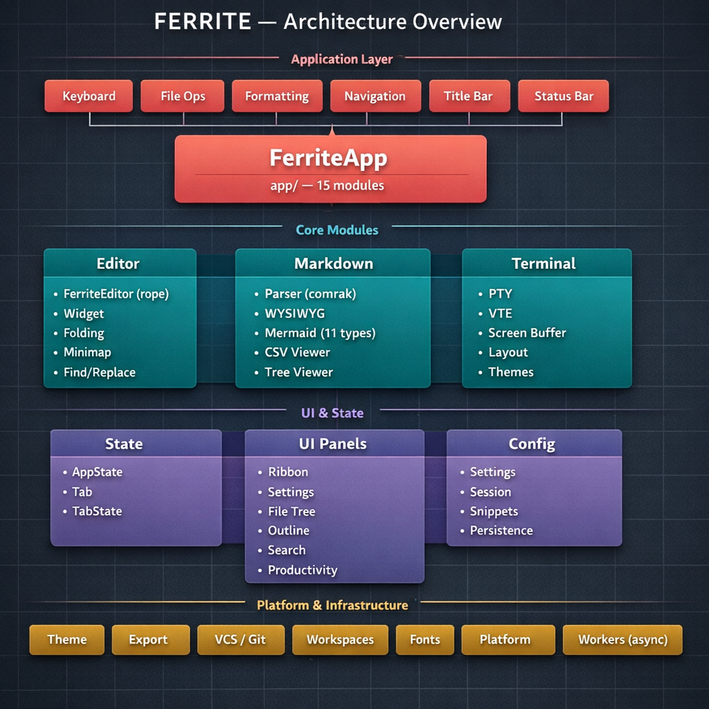
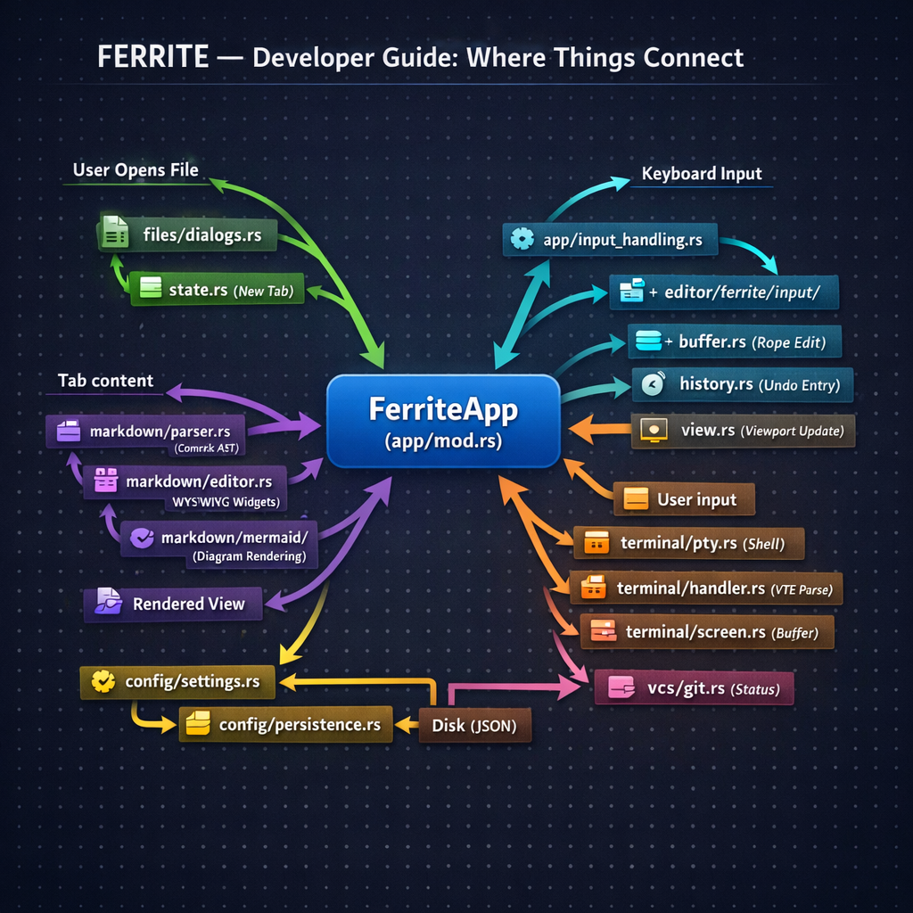

# Ferrite - Documentation

A fast, lightweight text editor for Markdown, JSON, and more. Built with Rust and egui.

## Quick Links

- [README](../README.md) - Project overview and installation
- [Building Guide](./building.md) - Build from source instructions
- [CLI Reference](./cli.md) - Command-line interface documentation
- [Contributing](../CONTRIBUTING.md) - Contribution guidelines
- [AI Context](./ai-context.md) - Lean context file for AI assistant sessions
- [v0.2.6 Test Suite](./v0.2.6-manual-test-suite.md) - Manual testing checklist for FerriteEditor release

---

## Visual Architecture Guide

These diagrams provide a quick visual overview for new contributors.

### Layered Architecture



### Data Flow & Module Interactions



---

## Technical Documentation

### Configuration & Setup

| Document | Description |
|----------|-------------|
| [Project Setup](./technical/config/project-setup.md) | Initial project configuration, dependencies, and build setup |
| [Error Handling](./technical/config/error-handling.md) | Centralized error system, Result type, logging, graceful degradation |
| [Settings & Config](./technical/config/settings-config.md) | Settings struct, serialization, validation, sanitization |
| [Config Persistence](./technical/config/config-persistence.md) | Platform-specific config storage, load/save functions, fallback handling |
| [Log Level Config](./technical/config/log-level-config.md) | Configurable log verbosity via config.json and --log-level CLI flag |
| [Internationalization](./technical/config/i18n.md) | rust-i18n integration, Language enum, translation keys, adding languages |
| [Multi-Encoding Support](./technical/config/multi-encoding.md) | Character encoding detection (chardetng), manual selection, save in original encoding |
| [Snippets System](./technical/config/snippets-system.md) | Text expansion system with built-in date/time snippets and custom user snippets |
| [New File Save Prompt](./technical/config/new-file-save-prompt.md) | Skip save prompt for unmodified untitled files, should_prompt_to_save() logic |
| [Default View Mode](./technical/config/default-view-mode.md) | Per-file-type default view mode configuration |

### Editor Core

| Document | Description |
|----------|-------------|
| **[Architecture](./technical/editor/architecture.md)** | **⚠️ REQUIRED READING: Core principles, complexity tiers, memory budget, anti-patterns** |
| **[FerriteEditor](./technical/editor/ferrite-editor.md)** | **Custom editor widget integrating TextBuffer, EditHistory, ViewState, LineCache** |
| **[TextBuffer](./technical/editor/text-buffer.md)** | **Rope-based text buffer for O(log n) editing operations on large files** |
| **[EditHistory](./technical/editor/edit-history.md)** | **Operation-based undo/redo for memory-efficient large file editing** |
| **[ViewState](./technical/editor/view-state.md)** | **Viewport tracking and visible line range calculation for virtual scrolling** |
| **[LineCache](./technical/editor/line-cache.md)** | **LRU-cached galley storage for efficient text rendering without recreation each frame** |
| **[Large File Performance](./technical/editor/large-file-performance.md)** | **Per-frame optimizations for 5MB+ files: hash avoidance, minimap disable, content caching** |
| **[Memory Optimization](./technical/editor/memory-optimization.md)** | **Tab closure cleanup, FerriteEditorStorage management, debug vs release performance** |
| **[Word Wrap](./technical/editor/word-wrap.md)** | **Phase 2 word wrap support: visual row tracking, wrapped galley caching, cursor navigation** |
| [Editor Widget](./technical/editor/editor-widget.md) | Text editor widget, cursor tracking, scroll persistence, egui TextEdit integration |
| [Line Numbers & Gutter](./technical/editor/line-numbers.md) | Gutter system with toggleable line numbers and fold indicators, dynamic width calculation |
| [Line Number Alignment](./technical/editor/line-number-alignment.md) | Technical fix for line number drift, galley-based positioning |
| [Cursor Position Mapping](./technical/editor/cursor-position-mapping.md) | Raw-to-displayed text position mapping for formatted content editing |
| [Galley Cursor Positioning](./technical/editor/galley-cursor-positioning.md) | Pixel-accurate cursor placement using egui Galley text layout |
| [Undo/Redo System](./technical/editor/undo-redo.md) | Per-tab undo/redo with keyboard shortcuts (Ctrl+Z, Ctrl+Y) |
| [Find and Replace](./technical/editor/find-replace.md) | Search functionality with regex, match highlighting, replace operations |
| [Go to Line](./technical/editor/go-to-line.md) | Ctrl+G modal dialog for line navigation, viewport centering |
| [Duplicate Line](./technical/editor/duplicate-line.md) | Ctrl+Shift+D line/selection duplication, char-to-byte index handling |
| [Move Line](./technical/editor/move-line.md) | Alt+↑/↓ line reordering, pre-render key consumption, cursor following |
| [Code Folding](./technical/editor/code-folding.md) | Fold region detection, gutter indicators, content hiding |
| [Code Folding UI](./technical/editor/code-folding-ui.md) | Code folding user interface and interactions |
| [Multi-Cursor Editing](./technical/editor/multi-cursor.md) | Multiple cursor support with Ctrl+Click, simultaneous editing, cursor navigation, selection merging |
| [Semantic Minimap](./technical/editor/semantic-minimap.md) | Semantic minimap with clickable heading labels, content type indicators, density visualization bars |
| [Editor Minimap (Legacy)](./technical/editor/minimap.md) | VS Code-style pixel minimap (replaced by semantic minimap) |
| [Search Highlight](./technical/editor/search-highlight.md) | Search-in-files result navigation with transient highlight, auto Raw mode switch |
| [Syntax Highlighting](./technical/editor/syntax-highlighting.md) | Syntect integration for code block highlighting |
| [Auto-close Brackets](./technical/editor/auto-close-brackets.md) | Auto-pair insertion, selection wrapping, skip-over behavior for brackets/quotes |
| [Bracket Matching](./technical/editor/bracket-matching.md) | Highlight matching brackets and parentheses |
| [Font System](./technical/editor/font-system.md) | Custom font loading, EditorFont enum, bold/italic variants |
| [Custom Font Selection](./technical/editor/custom-font-selection.md) | System font enumeration, custom font picker, CJK regional preferences |

### UI Components

| Document | Description |
|----------|-------------|
| [Ribbon UI](./technical/ui/ribbon-ui.md) | Modern ribbon interface replacing menu bar, icon-based controls |
| [Ribbon Redesign](./technical/ui/ribbon-redesign.md) | Design C streamlined ribbon, title bar integration, dropdown menus |
| **[Special Tabs](./technical/ui/special-tabs.md)** | **Tab-based UI panels (Settings, About/Help) replacing modal windows, extensible for future panels** |
| [Settings Panel](./technical/ui/settings-panel.md) | Settings UI in a special tab, live preview, appearance/editor/files/keyboard/terminal sections |
| [Outline Panel](./technical/ui/outline-panel.md) | Document outline side panel, heading extraction, statistics for structured files |
| [Status Bar](./technical/ui/status-bar.md) | Bottom status bar with file path, stats, toast messages |
| [About/Help Panel](./technical/ui/about-help.md) | About/Help in a special tab, version info, keyboard shortcuts reference |
| [Zen Mode](./technical/ui/zen-mode.md) | Distraction-free writing mode, centered text column, chrome hiding, F11 toggle |
| [Split View](./technical/ui/split-view.md) | Side-by-side raw editor + rendered preview, draggable splitter, independent scrolling |
| [Search Panel Viewport](./technical/ui/search-panel-viewport.md) | Viewport constraints for Search panel, DPI handling, resize behavior |
| [Quick Switcher Mouse Support](./technical/ui/quick-switcher-mouse-support.md) | Mouse hover/click fix with layer-based background, interaction overlay, hover-selection sync |
| [Keyboard Shortcuts](./technical/ui/keyboard-shortcuts.md) | Global shortcuts for file ops, tab navigation, deferred action pattern |
| [Keyboard Shortcut Customization](./technical/ui/keyboard-shortcut-customization.md) | Settings panel for rebinding shortcuts with conflict detection, persistence, and reset |
| [Light Mode Contrast](./technical/ui/light-mode-contrast.md) | WCAG AA color tokens, contrast ratios, border/text improvements |
| [Theme System](./technical/ui/theme-system.md) | Unified theming with ThemeColors, ThemeManager, light/dark themes, runtime switching |
| [Adaptive Toolbar](./technical/ui/adaptive-toolbar.md) | File-type aware toolbar, conditional buttons for Markdown vs JSON/YAML/TOML |
| [Navigation Buttons](./technical/ui/nav-buttons.md) | Document navigation overlay for quick jumping to top, middle, or bottom |
| [Check for Updates](./technical/ui/check-for-updates.md) | Manual update checker via GitHub Releases API, security model, URL validation |

### Markdown & WYSIWYG

| Document | Description |
|----------|-------------|
| [Markdown Parser](./technical/markdown/markdown-parser.md) | Comrak integration, AST parsing, GFM support |
| [WYSIWYG Editor](./technical/markdown/wysiwyg-editor.md) | WYSIWYG markdown editing widget, source synchronization, theming |
| [WYSIWYG Interactions](./technical/markdown/wysiwyg-interactions.md) | WYSIWYG user interaction patterns and behaviors |
| [Editable Widgets](./technical/markdown/editable-widgets.md) | Standalone editable widgets for headings, paragraphs, lists |
| [Editable Code Blocks](./technical/markdown/editable-code-blocks.md) | Syntax-highlighted code blocks with edit mode, language selection |
| [Editable Links](./technical/markdown/editable-links.md) | Hover-based link editing with popup menu, autolink support |
| [Editable Tables](./technical/markdown/editable-tables.md) | Table editing with cell navigation and formatting |
| [Click-to-Edit Formatting](./technical/markdown/click-to-edit-formatting.md) | Hybrid editing for formatted list items and paragraphs |
| [Formatting Toolbar](./technical/markdown/formatting-toolbar.md) | Markdown formatting toolbar, keyboard shortcuts, selection handling |
| [Emphasis Rendering](./technical/markdown/emphasis-rendering.md) | Bold, italic, strikethrough rendering in WYSIWYG |
| [Table of Contents](./technical/markdown/table-of-contents.md) | TOC generation from headings, anchor links, update/insert modes, Ctrl+Shift+U |
| [List Editing Fixes](./technical/markdown/list-editing-fixes.md) | Frontmatter offset fix, edit buffer persistence, deferred commits, rendered-mode undo/redo |
| [List Editing Debug](./technical/markdown/list-editing-debug.md) | Debugging list editing issues and fixes |
| [Table Editing Focus](./technical/markdown/table-editing-focus.md) | Fix cursor loss during table cell editing, deferred source updates, keyboard navigation |
| [Smart Paste](./technical/markdown/smart-paste.md) | URL detection, markdown link creation with selection, image markdown insertion |
| [Image Drag & Drop](./technical/markdown/image-drag-drop.md) | Drag images into editor, auto-save to assets/, insert markdown link at cursor |
| [CJK Paragraph Indentation](./technical/markdown/cjk-paragraph-indentation.md) | First-line paragraph indentation for Chinese (2em) and Japanese (1em) typography conventions |
| [Block Element Alignment](./technical/markdown/block-element-alignment.md) | Consistent 4px left indent for tables, code blocks, blockquotes, and other block elements |
| [GitHub-Style Callouts](./technical/markdown/github-callouts.md) | GitHub-style callouts (`> [!NOTE]`, `> [!TIP]`, etc.) with color-coded rendering, collapse toggle |

### Data Viewers

| Document | Description |
|----------|-------------|
| [CSV Viewer](./technical/viewers/csv-viewer.md) | CSV/TSV table viewer with scrolling, header highlighting, cell tooltips |
| [CSV Delimiter Detection](./technical/viewers/csv-delimiter-detection.md) | Auto-detect delimiter (comma/tab/semicolon/pipe), manual override, session persistence |
| [CSV Header Detection](./technical/viewers/csv-header-detection.md) | Auto-detect header rows with heuristics, toggle UI, column alignment |
| [CSV Rainbow Columns](./technical/viewers/csv-rainbow-columns.md) | Subtle alternating column colors using Oklch, status bar toggle |
| [Tree Viewer](./technical/viewers/tree-viewer.md) | JSON/YAML/TOML tree viewer with inline editing, expand/collapse, path copying |
| [Live Pipeline](./technical/viewers/live-pipeline.md) | JSON/YAML command piping through shell commands (jq, yq), recent history, output display |
| [Document Export](./technical/viewers/document-export.md) | HTML export with themed CSS, Copy-as-HTML clipboard functionality |

### File Operations & Workspaces

| Document | Description |
|----------|-------------|
| [File Dialogs](./technical/files/file-dialogs.md) | Native file dialogs with rfd, open/save operations |
| [Tab System](./technical/files/tab-system.md) | Tab data structure, tab bar UI, close buttons, unsaved changes dialog |
| [Recent Files](./technical/files/recent-files.md) | Recent files menu in status bar |
| [Workspace Folder Support](./technical/files/workspace-folder-support.md) | Folder workspace mode, file tree, quick switcher, search in files, file watching |
| [Session Persistence](./technical/files/session-persistence.md) | Crash-safe session state, tab restoration, recovery dialog, lock file mechanism |
| [Auto-Save](./technical/files/auto-save.md) | Configurable auto-save with temp file backups, toolbar toggle, recovery dialog |
| [Git Integration](./technical/files/git-integration.md) | Branch display in status bar, file tree Git status badges, git2 integration |
| [Git Auto-Refresh](./technical/files/git-auto-refresh.md) | Automatic git status refresh on save, focus, and periodic intervals |

### Terminal Emulator

| Document | Description |
|----------|-------------|
| [Terminal Architecture](./technical/terminal/terminal-architecture.md) | Integrated terminal with PTY (portable-pty), VTE parsing, screen buffer, ANSI color support |
| [Terminal UI](./technical/terminal/terminal-ui.md) | Terminal panel with tabs, split panes, floating windows, drag-and-drop, maximize pane |
| [Terminal Themes](./technical/terminal/terminal-themes.md) | Terminal color schemes (Solarized, Dracula, Monokai, Nord, etc.) |
| [Terminal Layout](./technical/terminal/terminal-layout.md) | Split pane layouts (horizontal/vertical), grid creation, layout save/load |

*Note: Technical docs for terminal are planned. See PR [#74](https://github.com/OlaProeis/Ferrite/pull/74) for feature details.*

### Productivity Hub

| Document | Description |
|----------|-------------|
| [Productivity Panel](./technical/productivity/productivity-panel.md) | Task management, Pomodoro timer, quick notes with workspace-scoped persistence |

*Note: Technical docs for productivity hub are planned. See PR [#74](https://github.com/OlaProeis/Ferrite/pull/74) for feature details.*

### Async Workers

| Document | Description |
|----------|-------------|
| [Worker Infrastructure](./technical/workers/worker-infrastructure.md) | Background tokio runtime, channel-based UI communication, worker pattern |

*Note: Technical docs for workers are planned. Feature-gated behind `async-workers`.*

### Platform-Specific

| Document | Description |
|----------|-------------|
| [eframe Window](./technical/platform/eframe-window.md) | Window lifecycle, dynamic titles, responsive layout, state persistence |
| [Custom Title Bar](./technical/platform/custom-title-bar.md) | Windows-style custom title bar implementation |
| [Window Resize](./technical/platform/window-resize.md) | Custom resize handles for borderless windows, edge detection, cursor icons |
| [Windows Borderless Window](./technical/platform/windows-borderless-window.md) | Top edge resize fix, fullscreen toggle (F10), title bar button area exclusion |
| [Windows Path Normalization](./technical/platform/windows-path-normalization.md) | Strip Windows `\\?\` prefix from canonicalized paths to prevent duplicates and git issues |
| [Linux Cursor Flicker Fix](./technical/platform/linux-cursor-flicker-fix.md) | Title bar exclusion zone to prevent cursor conflicts with window controls |
| **[Idle Mode Optimization](./technical/platform/idle-mode-optimization.md)** | **Tiered idle repaint system to reduce CPU usage on all platforms** |
| **[SignPath Code Signing](./technical/platform/signpath-code-signing.md)** | **Windows code signing via SignPath for OSS** |
| [macOS Intel CPU Optimization](./technical/platform/macos-intel-cpu-optimization.md) | Idle repaint optimization to reduce CPU usage on Intel Macs |
| [Intel Mac Repaint Investigation](./technical/platform/intel-mac-continuous-repaint-investigation.md) | Investigation into continuous repaint issues on Intel Macs |
| [Intel Mac CPU Analysis](./technical/platform/intel-mac-cpu-issue-analysis.md) | Analysis of CPU usage issues on Intel Mac hardware |

### Distribution & Packaging

| Document | Description |
|----------|-------------|
| **[Flathub Maintenance](./flathub-maintenance.md)** | **How to maintain and update Ferrite on Flathub (release checklist, cargo-sources, moderation)** |
| [Linux Package Distribution Plan](./linux-package-distribution-plan.md) | Plan for distributing Ferrite via Flathub, Snap, AUR, and native packages |

### Mermaid Diagrams

| Document | Description |
|----------|-------------|
| [Mermaid Diagrams](./technical/mermaid/mermaid-diagrams.md) | MermaidJS code block detection, diagram type indicators, styled rendering |
| [Mermaid Text Measurement](./technical/mermaid/mermaid-text-measurement.md) | TextMeasurer trait, dynamic node sizing, egui font metrics integration |
| [Mermaid Modular Structure](./technical/mermaid/mermaid-modular-structure.md) | Modular directory layout for diagram types, TextMeasurer trait, shared utilities |
| [Mermaid Edge Parsing](./technical/mermaid/mermaid-edge-parsing.md) | Chained edge parsing fix, arrow pattern matching, label extraction |
| [Mermaid classDef Styling](./technical/mermaid/mermaid-classdef-styling.md) | Node styling with classDef/class directives, hex color parsing, NodeStyle struct |
| [Mermaid YAML Frontmatter](./technical/mermaid/mermaid-frontmatter.md) | YAML frontmatter support for diagram titles, config parsing, graceful error handling |
| [Mermaid Caching](./technical/mermaid/mermaid-caching.md) | AST and layout caching for flowcharts, blake3 hashing, LRU eviction |
| [Flowchart Layout Algorithm](./technical/mermaid/flowchart-layout-algorithm.md) | Sugiyama-style layered graph layout, cycle detection, crossing reduction |
| [Flowchart Subgraphs](./technical/mermaid/flowchart-subgraphs.md) | Flowchart subgraph support, nested parsing, bounding box computation |
| [Flowchart Direction](./technical/mermaid/flowchart-direction.md) | Flow direction layout (LR/RL/TD/BT), axis transformation, edge anchoring |
| [Flowchart Branch Ordering](./technical/mermaid/flowchart-branch-ordering.md) | Decision node branch positioning, edge declaration order, barycenter algorithm |
| [Flowchart Subgraph Title](./technical/mermaid/flowchart-subgraph-title.md) | Subgraph title width expansion, preventing title truncation |
| [Flowchart Asymmetric Shape](./technical/mermaid/flowchart-asymmetric-shape.md) | Asymmetric (flag) shape rendering, text centering |
| [Flowchart Viewport Clipping](./technical/mermaid/flowchart-viewport-clipping.md) | Viewport clipping fix, negative coordinate shifting, subgraph node membership |
| [Flowchart linkStyle](./technical/mermaid/flowchart-linkstyle.md) | Edge styling via linkStyle directive, stroke color/width customization |
| [Flowchart Crash Prevention](./technical/mermaid/flowchart-crash-prevention.md) | Infinite loop safety, panic handling, graceful degradation for malformed input |
| [Subgraph Layer Clustering](./technical/mermaid/subgraph-layer-clustering.md) | Subgraph-aware layer assignment, consecutive layer clustering, internal edge layout |
| [Subgraph Internal Layout](./technical/mermaid/subgraph-internal-layout.md) | Subgraph internal positioning, SubgraphLayoutEngine, bounding box computation |
| [Subgraph Edge Routing](./technical/mermaid/subgraph-edge-routing.md) | Edge routing through subgraph boundaries, orthogonal waypoints |
| [Nested Subgraph Layout](./technical/mermaid/nested-subgraph-layout.md) | Nested subgraph margins, depth calculation, direction overrides |
| [Sequence Control Blocks](./technical/mermaid/sequence-control-blocks.md) | Sequence diagram loop/alt/opt/par blocks, nested parsing, block rendering |
| [Sequence Activations & Notes](./technical/mermaid/sequence-activations-notes.md) | Activation boxes, notes, +/- shorthand, state tracking |
| [State Composite Nested](./technical/mermaid/state-composite-nested.md) | State diagram composite and nested state support |
| **[Flowchart Refactor Plan](./technical/mermaid/flowchart-refactor-plan.md)** | **Task 58: Comprehensive analysis and refactoring plan for flowchart.rs modularization** |

### Planning & Roadmap

| Document | Description |
|----------|-------------|
| **[Custom Editor Widget Plan](./technical/planning/custom-editor-widget-plan.md)** | **v0.3.0 planning: Replace egui TextEdit with custom FerriteEditor widget** |
| **[Memory Optimization Plan](./technical/planning/memory-optimization.md)** | **v0.2.6 planning: Reduce idle RAM from ~250MB to ~100-150MB** |
| [Custom Memory Allocator](./technical/planning/custom-memory-allocator.md) | Platform-specific allocators (mimalloc/jemalloc) for reduced fragmentation |
| [egui Memory Cleanup](./technical/planning/egui-memory-cleanup.md) | Clean up rendered editor temp data in egui memory on tab close |
| [Viewer State Cleanup](./technical/planning/viewer-state-cleanup.md) | Memory leak fix: cleanup viewer state HashMaps on tab close |
| [Dead Code Cleanup](./technical/planning/dead-code-cleanup.md) | Task 39 cleanup summary, removed code, module changes |
| **[app.rs Refactoring Plan](./technical/planning/app-rs-refactoring-plan.md)** | **Split 7,634-line app.rs into ~15 focused modules under src/app/** |
| **[Mermaid Crate Plan](./mermaid-crate-plan.md)** | **Extract Mermaid renderer as standalone pure-Rust crate** |
| **[Math Support Plan](./math-support-plan.md)** | **v0.4.0 planning: Native LaTeX/TeX math rendering (pure Rust)** |

### Core (Remaining)

| Document | Description |
|----------|-------------|
| [App State](./technical/app-state.md) | AppState, Tab, UiState structs, undo/redo, event handling |
| [View Mode Persistence](./technical/view-mode-persistence.md) | Per-tab view mode storage, session restoration, backward compatibility |
| [Document Statistics](./technical/document-statistics.md) | Statistics panel tab with word count, reading time, heading/link/image counts |
| [Text Statistics](./technical/text-statistics.md) | Word, character, line counting for status bar |
| [Sync Scrolling](./technical/sync-scrolling.md) | Bidirectional scroll sync between Raw and Rendered views |
| [Configurable Line Width](./technical/configurable-line-width.md) | MaxLineWidth setting (Off/80/100/120/Custom), text centering in all views |
| [Branding](./branding.md) | Icon design, asset generation, platform integration guidelines |

---

## Guides

| Guide | Description |
|-------|-------------|
| [Adding Languages](./adding-languages.md) | How to add new translations, translation portal setup, contributor workflow |
| [Translation Status Assessment](./translation-status-assessment.md) | List of user-facing strings not yet using i18n (post v0.2.6.1), for Weblate extraction |
| *More coming soon* | Usage guides will be added as the app develops |

---

## Architecture Overview

```
ferrite/
├── src/
│   ├── main.rs              # Entry point, eframe setup, memory allocators
│   ├── app/                 # Main application (refactored from app.rs into ~15 modules)
│   │   ├── mod.rs           # FerriteApp struct, update loop coordination
│   │   ├── keyboard.rs      # Keyboard shortcut handling
│   │   ├── input_handling.rs # Input processing
│   │   ├── file_ops.rs      # File operations (open, save, close)
│   │   ├── formatting.rs    # Text formatting commands
│   │   ├── line_ops.rs      # Line operations (duplicate, move)
│   │   ├── navigation.rs    # Tab and cursor navigation
│   │   ├── find_replace.rs  # Find/replace integration
│   │   ├── export.rs        # Export operations
│   │   ├── dialogs.rs       # Dialog handling
│   │   ├── title_bar.rs     # Custom title bar rendering
│   │   ├── status_bar.rs    # Status bar rendering
│   │   ├── central_panel.rs # Central editor panel rendering
│   │   ├── helpers.rs       # Helper utilities
│   │   └── types.rs         # Shared type definitions
│   ├── state.rs             # AppState, Tab, TabState, FileType, event handling
│   ├── error.rs             # Error types and handling
│   ├── fonts.rs             # Custom font loading, lazy CJK, family selection
│   ├── path_utils.rs        # Windows path normalization (\\?\ prefix stripping)
│   ├── string_utils.rs      # String utility functions
│   ├── update.rs            # Update checker (GitHub Releases API, version comparison)
│   ├── config/              # Settings and persistence
│   │   ├── mod.rs           # Module exports
│   │   ├── settings.rs      # Settings struct, TabInfo, shortcuts, validation
│   │   ├── persistence.rs   # Config file load/save
│   │   ├── session.rs       # Session persistence, crash recovery, lock files
│   │   └── snippets.rs      # Text expansion snippets (;date, ;time, custom)
│   ├── editor/              # Text editor widgets
│   │   ├── mod.rs           # Module exports
│   │   ├── ferrite/         # FerriteEditor custom widget (modular)
│   │   │   ├── mod.rs       # Re-exports
│   │   │   ├── editor.rs    # Main FerriteEditor widget
│   │   │   ├── buffer.rs    # TextBuffer - rope-based text storage
│   │   │   ├── cursor.rs    # Cursor position tracking
│   │   │   ├── selection.rs # Selection handling
│   │   │   ├── history.rs   # EditHistory - operation-based undo/redo
│   │   │   ├── view.rs      # ViewState - viewport tracking
│   │   │   ├── line_cache.rs # LineCache - galley caching
│   │   │   ├── highlights.rs # Highlight rendering
│   │   │   ├── search.rs    # Search integration
│   │   │   ├── find_replace.rs # Find/replace within editor
│   │   │   ├── mouse.rs     # Mouse position → cursor conversion
│   │   │   ├── input/       # Input handling submodule
│   │   │   │   ├── keyboard.rs # Keyboard input
│   │   │   │   └── mouse.rs   # Mouse/scroll input
│   │   │   └── rendering/   # Rendering submodule
│   │   │       ├── text.rs    # Text rendering
│   │   │       ├── cursor.rs  # Cursor rendering
│   │   │       └── gutter.rs  # Gutter/line numbers rendering
│   │   ├── widget.rs        # EditorWidget with line numbers, search highlights
│   │   ├── line_numbers.rs  # Line counting utilities
│   │   ├── stats.rs         # Text statistics (words, chars, lines)
│   │   ├── find_replace.rs  # Find/replace panel and search logic
│   │   ├── folding.rs       # Code folding logic
│   │   ├── matching.rs      # Bracket matching
│   │   ├── minimap.rs       # Semantic minimap
│   │   └── outline.rs       # Document outline extraction
│   ├── files/               # File operations
│   │   ├── mod.rs           # Module exports
│   │   └── dialogs.rs       # Native file dialogs (rfd)
│   ├── markdown/            # Parser and WYSIWYG editor
│   │   ├── mod.rs           # Module exports
│   │   ├── parser.rs        # Comrak integration, AST parsing
│   │   ├── editor.rs        # WYSIWYG markdown editor
│   │   ├── widgets.rs       # Editable heading/list/table widgets
│   │   ├── syntax.rs        # Syntax highlighting (syntect)
│   │   ├── ast_ops.rs       # AST operations and manipulation
│   │   ├── formatting.rs    # Markdown formatting commands
│   │   ├── toc.rs           # Table of Contents generation
│   │   ├── csv_viewer.rs    # CSV/TSV table viewer
│   │   ├── tree_viewer.rs   # JSON/YAML/TOML tree viewer widget
│   │   └── mermaid/         # Native Mermaid diagram rendering (11 types)
│   │       ├── mod.rs       # MermaidRenderer, caching (blake3)
│   │       ├── flowchart.rs # Flowchart diagrams
│   │       ├── sequence.rs  # Sequence diagrams
│   │       ├── pie.rs       # Pie charts
│   │       ├── state.rs     # State diagrams
│   │       ├── mindmap.rs   # Mindmaps
│   │       ├── gantt.rs     # Gantt charts
│   │       ├── timeline.rs  # Timelines
│   │       ├── journey.rs   # User journey maps
│   │       ├── git_graph.rs # Git graph diagrams
│   │       ├── frontmatter.rs # YAML frontmatter support
│   │       ├── text.rs      # Text measurement
│   │       └── utils.rs     # Shared utilities
│   ├── terminal/            # Integrated terminal emulator
│   │   ├── mod.rs           # Terminal, TerminalManager, monitor detection
│   │   ├── pty.rs           # Cross-platform PTY (portable-pty)
│   │   ├── screen.rs        # Screen buffer, ANSI color cells
│   │   ├── handler.rs       # VTE event handler (escape sequences)
│   │   ├── widget.rs        # Terminal rendering widget
│   │   ├── layout.rs        # Split pane layouts (H/V, grid)
│   │   ├── theme.rs         # Terminal color schemes
│   │   └── sound.rs         # Notification sounds
│   ├── preview/             # Preview and sync scrolling
│   │   ├── mod.rs           # Module exports
│   │   └── sync_scroll.rs   # Bidirectional scroll synchronization
│   ├── export/              # Document export
│   │   ├── mod.rs           # Module exports
│   │   ├── html.rs          # HTML generation with theme CSS
│   │   ├── clipboard.rs     # Clipboard operations (arboard)
│   │   └── options.rs       # Export options and settings
│   ├── theme/               # Theming system
│   │   ├── mod.rs           # ThemeColors struct
│   │   ├── light.rs         # Light theme egui::Visuals
│   │   ├── dark.rs          # Dark theme egui::Visuals
│   │   └── manager.rs       # ThemeManager for runtime switching
│   ├── ui/                  # UI components
│   │   ├── mod.rs           # Module exports
│   │   ├── about.rs         # About/Help panel with shortcuts reference
│   │   ├── icons.rs         # Icon loading for window/taskbar icons
│   │   ├── ribbon.rs        # Ribbon interface (replaces menu bar)
│   │   ├── settings.rs      # Settings panel modal
│   │   ├── outline_panel.rs # Document outline side panel
│   │   ├── file_tree.rs     # File tree sidebar panel
│   │   ├── quick_switcher.rs # Quick file switcher (Ctrl+P)
│   │   ├── search.rs        # Search in files (Ctrl+Shift+F)
│   │   ├── pipeline.rs      # Live Pipeline panel (JSON/YAML command piping)
│   │   ├── terminal_panel.rs # Terminal panel (tabs, splits, floating windows)
│   │   ├── productivity_panel.rs # Productivity hub (tasks, Pomodoro, notes)
│   │   ├── dialogs.rs       # File operation dialogs
│   │   ├── nav_buttons.rs   # Document navigation buttons overlay
│   │   ├── view_segment.rs  # Title bar view mode segment, buttons
│   │   └── window.rs        # Custom window resize for borderless windows
│   ├── platform/            # Platform-specific code
│   │   ├── mod.rs           # Module exports, Apple Event paths
│   │   └── macos.rs         # macOS app delegate, Open With support
│   ├── vcs/                 # Version control integration
│   │   ├── mod.rs           # Module exports
│   │   └── git.rs           # GitService, status tracking (git2)
│   ├── workers/             # Async worker infrastructure (feature-gated)
│   │   ├── mod.rs           # WorkerHandle, WorkerCommand, WorkerResponse
│   │   └── echo_worker.rs   # Echo worker template (async-workers feature)
│   └── workspaces/          # Workspace/folder management
│       ├── mod.rs           # AppMode, Workspace, module exports
│       ├── file_tree.rs     # FileTreeNode, directory scanning
│       ├── settings.rs      # WorkspaceSettings persistence
│       ├── persistence.rs   # WorkspaceState persistence
│       └── watcher.rs       # File system watcher (notify)
├── locales/                 # Translation files (i18n)
│   ├── en.yaml              # English (base language)
│   ├── de.yaml              # German
│   ├── ja.yaml              # Japanese
│   ├── nb_NO.yaml           # Norwegian Bokmål
│   ├── pt.yaml              # Portuguese
│   ├── zh_Hans.yaml         # Simplified Chinese
│   └── et.yaml              # Estonian
├── assets/                  # Static assets
│   ├── fonts/               # TTF fonts (Inter, JetBrains Mono)
│   ├── icons/               # Application icons (16-512px PNG, ICO, ICNS)
│   ├── linux/               # Flatpak desktop entry and AppStream metainfo
│   ├── screenshots/         # App screenshots for README/stores
│   └── web/                 # Web favicon assets
├── build.rs                 # Build script (Windows icon embedding)
├── wix/                     # Windows MSI installer (cargo-wix)
├── .signpath/               # Code signing config (SignPath.io)
├── .github/                 # CI/CD workflows, issue/PR templates
├── docs/                    # Documentation (see below)
│   ├── index.md             # This file - documentation hub
│   ├── technical/           # Technical documentation by area
│   └── ai-workflow/         # AI development process docs
└── .taskmaster/             # Task management (Task Master AI)
```

---

## Tech Stack

| Component | Technology | Version |
|-----------|------------|---------|
| Language | Rust | 1.70+ |
| GUI | egui + eframe | 0.28 |
| Markdown | comrak | 0.22 |
| Syntax Highlighting | syntect + two-face | 5.1, 0.5 |
| Text Buffer | ropey | 1.6 |
| Serialization | serde + serde_json | 1.x |
| YAML Parsing | serde_yaml | 0.9 |
| TOML Parsing | toml | 0.8 |
| CSV Parsing | csv | 1.3 |
| File Dialogs | rfd | 0.14 |
| Platform Paths | dirs | 5 |
| URL Opening | open | 5 |
| CLI Parsing | clap | 4 |
| Logging | log + env_logger | 0.4, 0.11 |
| Regex | regex | 1.x |
| Clipboard | arboard | 3 |
| File Watcher | notify | 6 |
| Directory Walking | walkdir | 2 |
| Fuzzy Matching | fuzzy-matcher | 0.3 |
| Icon Loading | image | 0.25 |
| Font Enumeration | font-kit | 0.14 |
| Windows Icon | embed-resource | 2.4 |
| Git Integration | git2 | 0.19 |
| Hashing | blake3 | 1.5 |
| Slugification | slug | 0.1 |
| Date/Time | chrono | 0.4 |
| Color Palette | palette | 0.7 |
| Encoding | encoding_rs + chardetng | 0.8, 0.1 |
| Internationalization | rust-i18n + sys-locale | 3, 0.3 |
| Terminal PTY | portable-pty | 0.8 |
| Terminal ANSI Parser | vte | 0.13 |
| HTTP Client | ureq (+ rustls) | 2.x |
| Memory Allocator (Win) | mimalloc | 0.1 |
| Memory Allocator (Unix) | tikv-jemallocator | 0.6 |

---

## Development Notes

- Use `cargo build` to compile
- Use `cargo run` to run the application
- Use `cargo test` to run tests
- Use `cargo clippy` for linting

